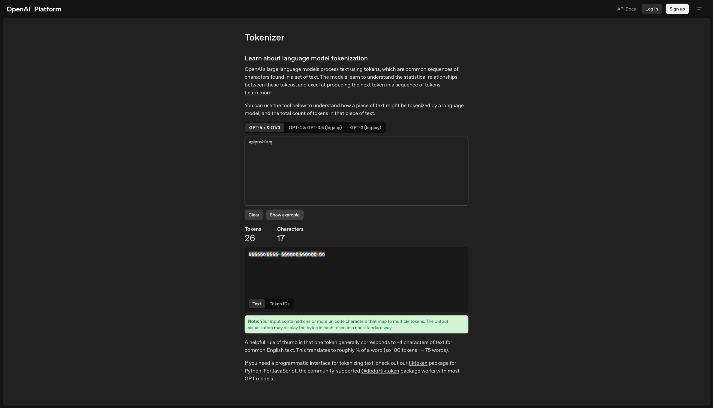
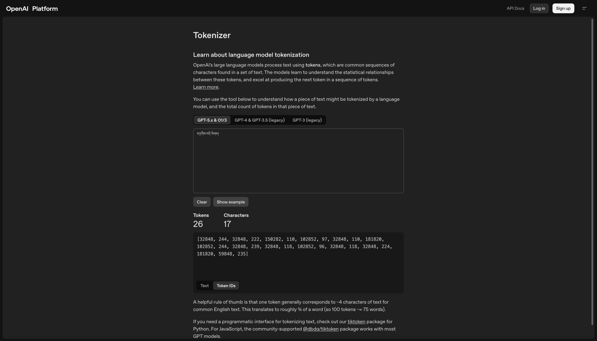

<!--
习题
• 阅读nltk.BigramTagger的训练程序
• 在单词中间插入另一个词加强语气叫
tmesis (https://emmawilkin.com/words-of￾the-week-2/2020/1/16/tmesis). 在英语中，
bloody是常用的加强语气的词，在汉语中
，则常见“他妈的”。请找出其他的一
些例子。(see also https://youtu.be/dt22yWYX64w)
• 测试GPT的tokenizer。输入藏文（或其他
语料很少的语言）会发生什么情况？
-->
- 阅读nltk.BigramTagger的训练程序
- 在单词中间插入另一个词加强语气叫tmesis ([https://emmawilkin.com/words-of￾the-week-2/2020/1/16/tmesis](https://emmawilkin.com/words-of￾the-week-2/2020/1/16/tmesis)). 在英语中，bloody是常用的加强语气的词，在汉语中，则常见“他妈的”。请找出其他的一些例子。(see also [https://youtu.be/dt22yWYX64w](https://youtu.be/dt22yWYX64w))
- 测试GPT的tokenizer。输入藏文（或其他语料很少的语言）会发生什么情况？

---

- [https://github.com/nltk/nltk/blob/develop/nltk/tag/sequential.py](https://github.com/nltk/nltk/blob/develop/nltk/tag/sequential.py)
	```python
	def _train(self, tagged_corpus, cutoff=0, verbose=False):
	"""
	Initialize this ContextTagger's ``_context_to_tag`` table
	based on the given training data.  In particular, for each
	context ``c`` in the training data, set
	``_context_to_tag[c]`` to the most frequent tag for that
	context.  However, exclude any contexts that are already
	tagged perfectly by the backoff tagger(s).

	The old value of ``self._context_to_tag`` (if any) is discarded.

	:param tagged_corpus: A tagged corpus.  Each item should be
		a list of (word, tag tuples.
	:param cutoff: If the most likely tag for a context occurs
		fewer than cutoff times, then exclude it from the
		context-to-tag table for the new tagger.
	"""

	token_count = hit_count = 0

	# A context is considered 'useful' if it's not already tagged
	# perfectly by the backoff tagger.
	useful_contexts = set()

	# Count how many times each tag occurs in each context.
	fd = ConditionalFreqDist()
	for sentence in tagged_corpus:
		tokens, tags = zip(*sentence)
		for index, (token, tag) in enumerate(sentence):
			# Record the event.
			token_count += 1
			context = self.context(tokens, index, tags[:index])
			if context is None:
				continue
			fd[context][tag] += 1
			# If the backoff got it wrong, this context is useful:
			if self.backoff is None or tag != self.backoff.tag_one(
				tokens, index, tags[:index]
			):
				useful_contexts.add(context)

	# Build the context_to_tag table -- for each context, figure
	# out what the most likely tag is.  Only include contexts that
	# we've seen at least `cutoff` times.
	for context in useful_contexts:
		best_tag = fd[context].max()
		hits = fd[context][best_tag]
		if hits > cutoff:
			self._context_to_tag[context] = best_tag
			hit_count += hits

	# Display some stats, if requested.
	if verbose:
		size = len(self._context_to_tag)
		backoff = 100 - (hit_count * 100.0) / token_count
		pruning = 100 - (size * 100.0) / len(fd.conditions())
		print("[Trained Unigram tagger:", end=" ")
		print(
			"size={}, backoff={:.2f}%, pruning={:.2f}%]".format(
				size, backoff, pruning
			)
		)
		
	```
- 
	- Abso-fucking-lutely
	- 高 你妹的 富帅
- 
	- བཀྲ་ཤིས་བདེ་ལེགས།
		- ������་����ས་������་������ས�� (Token IDs: \[32848, 244, 32848, 222, 150282, 110, 102852, 97, 32848, 110, 181820, 102852, 244, 32848, 239, 32848, 118, 102852, 96, 32848, 118, 32848, 224, 181820, 59848, 235\])
		- 
		- 
