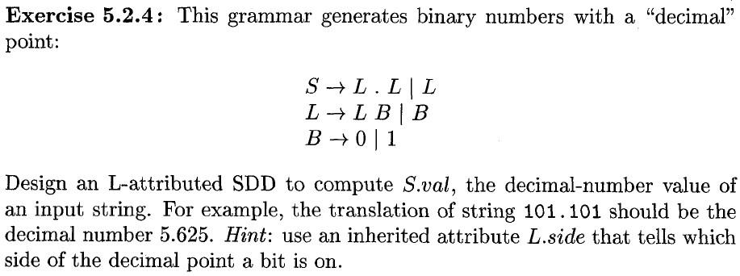
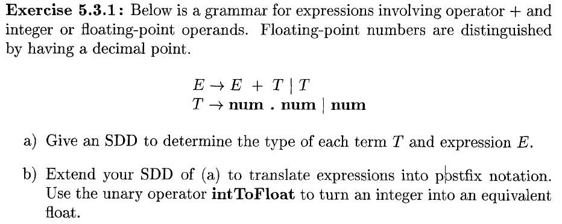
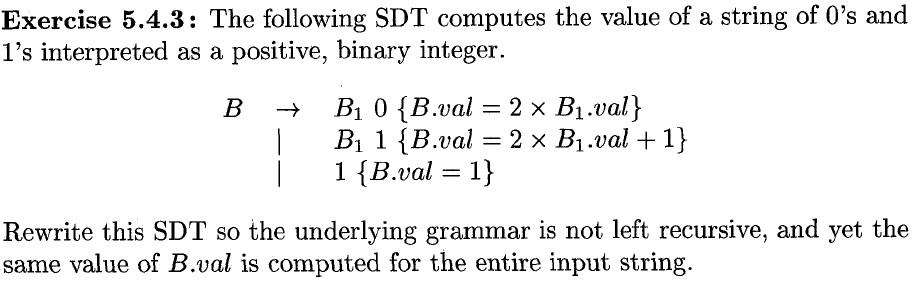

<!--
exercises

**5.2.4**

  

  

5.3.1

  

  

**5.4.3**
-->
# exercises

## **5.2.4**

  

  

## 5.3.1

  

  

## **5.4.3**

---

## 5.2.4
1. S -> L1.L2: S.val = L1.val + L2.val, L1.side = right, L2.side = left
2. S -> L: S.val = L.val, L.side = right
3. L1 -> L2 B: L1.val = 2\*L2.val + B.val if L2.side == right else L2.val + B.val / 2\^(L2.len + 1), L1.len = L2.len + 1, L1.side = L2.side
4. L -> B: L.val = B.val
5. B -> 0: B.val = 0
6. B -> 1: B.val = 1

## 5.3.1
### a)
1. E1 -> E2 + T: E.type = int if E2.type == int and T.type == int else float
2. E -> T: E.type = T.type
3. T -> num.num: T.type = float
4. T -> num: T.type = int

### b)
[a)](###a\)) + :
1. E1 -> E2 + T: E1.not = E2.not T.not + if E2.type == T.type else `intToFloat` E2.not T.not + if E2.type == float else E2.not `intToFloat` T.not +
2. E -> T: E.not = T.not

## 5.4.3
1. B -> 1 C: B.val = 2\^C.len + C.val
2. C1 -> 0 C2: C1.val = C2.val, C1.len = C2.len + 1
3. C1 -> 1 C2: C1.val = 2^C2.len + C2.val, C1.len = C2.len + 1
4. C -> $\varepsilon$: C.val = 0, C.len = 0
